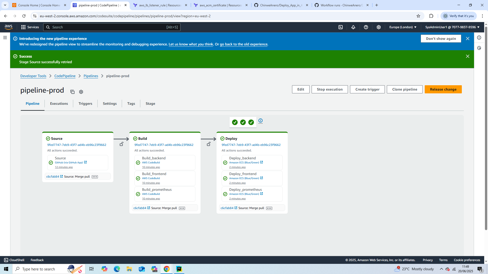
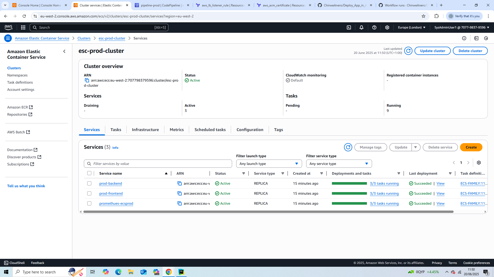
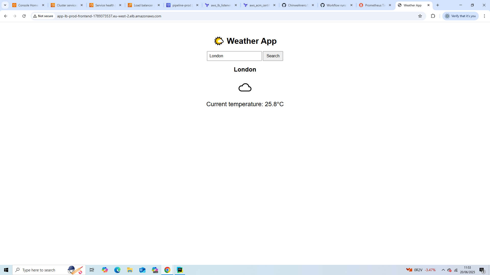
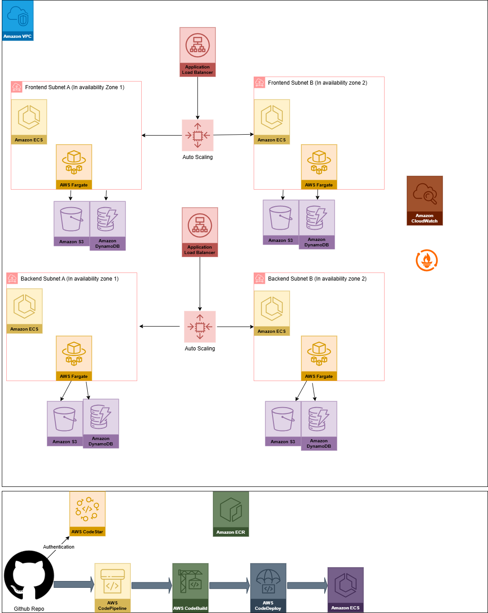
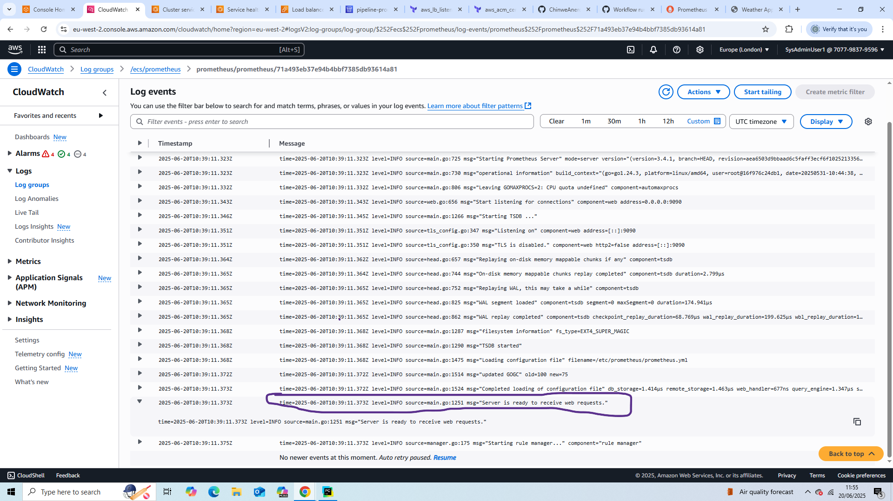
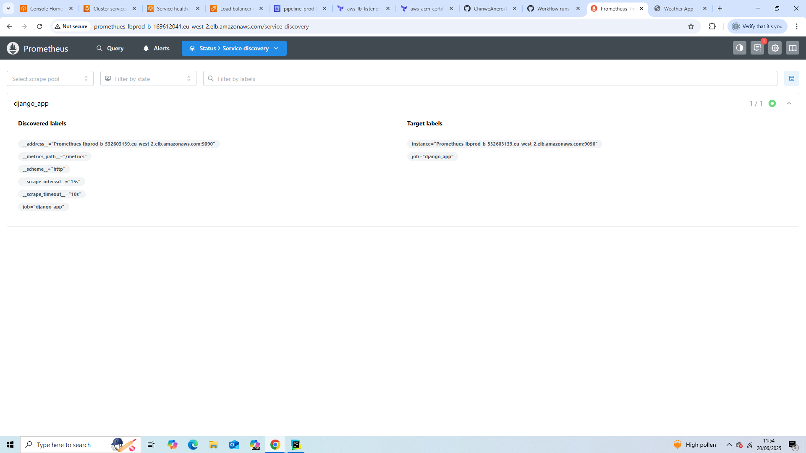
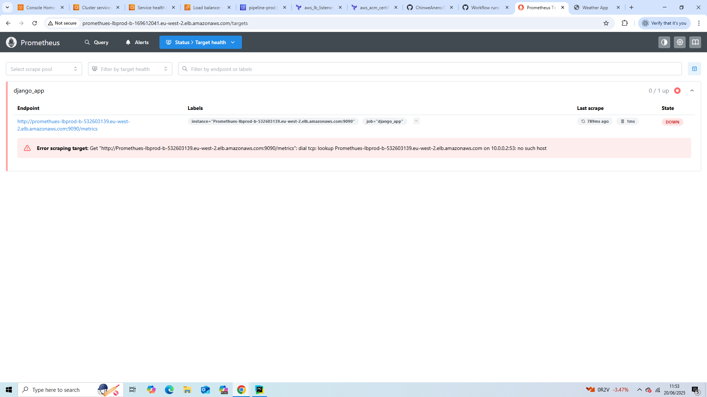

# Blue-Green deployment of django app to AWS ECS-Fargate with Cloudwatch and Prometheus monitoring
This project deploys a Django application to aws ecs fargate. Infrastructure is built with Terraform and CICD built with aws Developer tools (Codepipeline, Codebuild and Codedeploy) and Github Actions with CodeStar authentication to Github.

# Features
- Containerized Django App with Docker
- Fully managed CI/CD with AWS CodePipeline with CodeStar for github authentication
- Automatic build and deployment using CodeBuild and CodeDeploy
- ECS Fargate for serverless compute
- Application Load Balancer (ALB) for HTTP routing
- Custom VPC with public/private subnets
- Prometheus for scraping metrics
- CloudWatch Logs for monitoring and debugging

# Technology Stack used
- Docker
- Terraform
- AWS ECS Fargate
- AWS Developer tools (Codepipeline, CodeBuild, CodeDeploy)
- Cloudwatch
- AWS SSM Parameter store
- Application Load Balancer
- VPC, Subnets, Security Groups

# Prerequisites
- AWS Account
- AWS CLI Configured
- Docker
- Terraform cli configured (For Terraform remote backend, a terraform.io account is required to setup orgainisation, workspace and generate user tokens for github, etc)
- github repo

# CI/CD
Terraform cli via Github Actions does: on push to main branch
- Login to AWS using aws account credentials
- Runs terraform init
- Runs terraform plan
- Runs terraform apply

# Deployment CI/CD
The deployment Pipeline does: on push to main
- AWS CodeStar authenticates Codepipeline with Github
- Codepipeline pulls latest changes from github
- CodeBuild builds the docker images and pushes to ECR
- Latest changes are deployed to ECS by CodeDeploy

# CI/CD images

# Monitoring
- Cloudwatch logs
- Prometheus for metrics scraping

# Architecture Diagram

# NB
Prometheus monitoring isn't fully setup (yet), minor issues to fix

